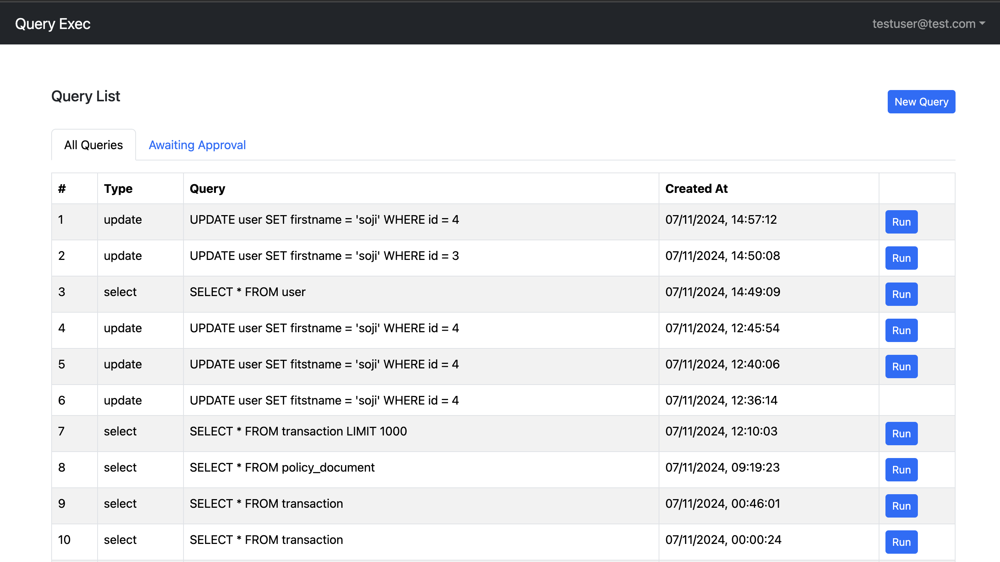

# QUERY EXEC

A simple CRUD app built for executing queries

It includes the following:
- Backend API with Express, Typescript & MongoDB
- Routes for auth, fetch, approve an dexec queries, user profile
- JWT authentication stored in HTTP-only cookie
- Protected routes and endpoints
- Custom middleware to check JSON web token and store in cookie
- React frontend to login, logout, execute queries, view profile, and update profile
- React Bootstrap UI library
- React Toastify notifications


....

....

....


### Env Variables

create file `.env` from the `.env.example` file using the details below:

```
NODE_ENV = development
PORT = 5000
MONGO_URI = your mongodb uri
JWT_SECRET = 'abc123'
```

```
# Credentials of database to execute query for
QUERY_DB_HOST=
QUERY_DB_PORT=
QUERY_DB_USER=
QUERY_DB_PASSWORD=
QUERY_DB_NAME=
QUERY_DB_DRIVER=
```

### Install Dependencies (frontend & backend)

```
npm install
cd frontend
npm install
```

### Run

```

# Run frontend (:3000) & backend (:5000)
npm run dev

# Run backend only
npm run server
```

## Build & Deploy

```
# Create frontend prod build
cd frontend
npm run build

or 

npm start
```
